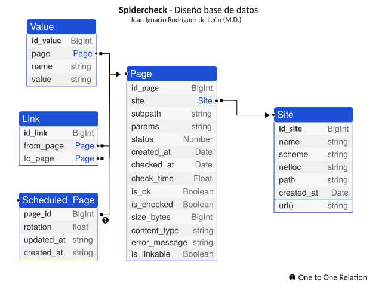

Modelo de base de datos
------------------------------------------------------------------------

En Spidercheck hay 5 tablas/modelos:

- `Site`
- `Page`
- `Link`
- `Value`
- `ScheduledPage`

Veremos cada uno de estos modelos con más detalles en las siguientes secciones.

La tabla ``Site``
^^^^^^^^^^^^^^^^^^^^^^^^^^^^^^^^^^^^^^^^^^^^^^^^^^^^^^^^^^^^^^^^^^^^^^^^

En esta tabla es donde almacenamos la información de cada _site_ o _web_
que queramos analizar. A la hora de crear un ``Site``, tenemos que
asignarle un nombre y una *url* de inicio. Todos los urls que casen con
la url se consideran **enlaces internos** y se analizarán. Los que no,
se consideran **enlaces externos** y se ignoran.

Por ejemplo, si nuestro `Site` define como página de inicio
``http://localhost/alpha/``, entonces la página
``http://localhost/alpha/algo/`` se considera interna, pero
``http://localhost/omega/`` se considera externa y, por tanto, no se
analizará. En otras palabras, se restrea ``http://localhost/alpha/*``.

El modelo ``Site`` contiene los siguientes campos:

- ``id_site`` : Clave primaría

- ``name`` : Nombre. Clave candidata (Debe ser único)

- ``scheme`` : Esquema a usar para la URL inicial del sitio. En
  principio ``http`` o ``https``.

- ``netloc`` : Nombre del host

- ``path`` : Ruta inicial o semilla

- ``created_at`` : Marca temporal de creación

Algunos de los métodos más destacados de este modelo son:

- ``load_site_by_name(name: str) -> Site|None`` : **Método de clase**.
  Permite obtener una instancia a partir del nombre. Devuelve ``None``
  si no existe ningún site con el nombre indicado.

- ``get_all_sites() -> Iterable[Site]`` : **Método de clase**. Devuelve
  un iterador que recorre todos los sites definidos.

- ``url(path) -> str`` : Devuelve una URL absoluta, compuesta a partir
  de los campos ``scheme``, ``netloc`` y el parámetro ``path``. Si no se
  incluye el parámetro ``path``, que es opcional, se devuelve la semilla.
  Si se especifica, es responsabilidad del llamador
  comprobar que es una URL interna. Ver el método `is_local`.

- ``next_page_to_check() -> Page`` : Devuelve la siguiente dirección que
  debemos comprobar.

- ``is_local(path: str) -> bool`` : Verdadero si la ruta pasada es local
  al *site*.

- ``load_or_create(subpath: str, params: dict) -> Page`` : Este método
  busca en la base de datos una página que se corresponda, para el *site*,
  con la ruta y los parámetros pasados. Si la encuentra, se devuelve
  dicha página, si no, se crea y se devuelve.

La tabla ``Page``
^^^^^^^^^^^^^^^^^^^^^^^^^^^^^^^^^^^^^^^^^^^^^^^^^^^^^^^^^^^^^^^^^^^^^^^^

Para cada url encontrada (Ya sea un enlace a otra url, una referencia a
una imagen, a una hoja de estilos css, etc.), si se considera interna,
se creara una entrada en esta tabla.

Los campos de este modelo son:

- ``id_page``: Clave primaria de la página.

- ``site``: Clave foranea al modelo ``Site``. Todas las páginas están
  vinculadas con un *site*,

- ``subpath``: Concatenando este campo con el campo ``path`` del *site*,
  obtenemos la ruta absoluta de la página. Si concatenamos
  ``site.scheme`` + ``site.netloc`` + ``site.path`` + ``page.subpath``
  obtenemos la URL absoluta de la página (Ver método ``page.url()``. 

- ``params``: Si la URL incluye parámetros, se almacenan en este campo,
  en formato JSON. Si no tiene parámetros, el valor será la cadena
  vacía, nunca `NULL`.

- ``is_checked`` : Indicador lógico para saber si una página se ha
  intentado comprobar alguna vez.

- ``checked_at`` : Una marca temporal que nos indica en que momento se
  intentó realizar la última comprobación, si la hubo. Si nunca se ha
  intentado comprobar, el valor del campo es el EPOCH_. **Nota: Es
  redundante con el campo `is_checked`**. Quizá habría que eliminar ese
  campo y sustituirlo por una propiedad_ Python.

- ``check_time`` : El número de segundos que le ha llevado a Spidercheck 
  comprobar está página, si ha sido comprobada. 

- ``status``: El valor de estado devuelto, siguiendo el `protocolo HTTP`_,
   por el servidor. Para una página correcta, será normalmente un $200$ o
   un número en el rango $2XX$. Si no se ha comprobado nunca, vale $0$.

- ``created_at`` : Marca temporal que indica cuando se creó la página (En
  la base de datos).

- ``size_bytes``: El tamaño, en *bytes*, de la página o archivo.

- ``content-type``: El `tipo MIME`_ que define el contenido de la página.
  Para páginas HTML, será `text/html`.

- ``error_message``: Si el servidor ha respondido a la petición de esta
  página con un código distinto de $2XX$, y se ha tomado la molestia de
  incluir un mensaje en la respuesta indicando la causa del error, dicho
  mensaje se almacena en este campo.

- ``is_linkable``: Valor lógico que indica si debemos almacenar los enlaces
  que *apuntan* a esta página. Esto nos permite ahorrar mucho espacio en la
  base de datos marcando aquellas páginas que son referenciadas desde **todas
  o la mayoría** de las demás páginas. Por defecto vale `False`.

Algunos de los métodos más destacados de este modelo son:

- ``load_page(id_pag: int) -> Self`` : **Método de clase**. Devuelve la página
  indicada usando su clave primaria, o `None` si no existe.

- ``get_all_valid_links(html_text: str) -> Iterable[str]`` : Lista todos los
  enlaces encontrados en una página HTML. Si son enlaces externos, o están
  excluidos en el `robots.txt` no se consideran válidas y no se incluyen en
  el resultado.
     
- ``is_ok() -> bool`` : Devuelve verdadero (`True`) si y solo si el código de
  respuesta obtenido en el rango $2xx$.

- ``can_be_deleted() -> bool`` : Devuelve verdadero (`True`) si la página puede
  ser borrada. Por ahora, la única condición para poder ser borrada es que no
  exista ninguna otra página que tenga a esta como destino.

- ``get_full_url() -> str`` : Devuelve el URL completo de la página, incluyendo
  el esquema (``http`` o ``https``).

- ``is_valid() -> Success|Failure``: Comprueba si la página es correcta. Para
  ello, se realiza una petición de tipo ``HEAD`` al servidor, y se verifica que
  la respuesta sea correcta. Devuelve una instancia de `Success` si es correcta, o
  una instancia de `Failure` en caso contrario.

- ``waiting_time() ->  datetime.timedelta``: El lapso de tiempo, en formato
  ``datetime.timedelta``, desde la última vez que esta página fue comprobada.

- ``is_scheduled() -> bool``: Indica si la página está programada. Ver
  modelo `SchudelePage`. Las páginas programadas se actualizan de forma
  periódica, saltándose el protocolo normal.

El modelo `Link`
^^^^^^^^^^^^^^^^^^^^^^^^^^^^^^^^^^^^^^^^^^^^^^^^^^^^^^^^^^^^^^^^^^^^^^^^

Este modelo almacena la relación que se establece entre dos páginas cuando una de
ellas enlaza a la otra. Es una relación ``N x N`` entre la tabla ``Page`` y otra vez
la tabla ``Page``. Los campos de este modelo son:

    
- ``id_link``: La clave primaría del enlace.
    
- ``from_page``: Clave foránea a la página de la que sale el enlace.

- ``to_page``: Clave foránea a la página a la que se dirige en enlace.

Existe una restricción que impide crear dos enlaces iguales, es decir, que se originen
en una misma página y enlazan a otra página, también la misma. En otras palabras, la
información de que la página `A` enlaza con la página `B` sólo está almacenada una vez
en la base de datos.

La definición de las claves foráneas provoca que en la clase `Page` se creen los 
atributos ``outgoing_link`` (Enlaces salientes) e ``incoming_links`` (enlaces entrantes).

El modelo `Value`
^^^^^^^^^^^^^^^^^^^^^^^^^^^^^^^^^^^^^^^^^^^^^^^^^^^^^^^^^^^^^^^^^^^^^^^^

Permite almacenar determinados valores asignados a las páginas.

Spidercheck permite almacenar valores particulares para cada página.
Estos valores se pueden conseguir de diferentes sitios, y el sistema de
*plugins* permite guardar estos valores de forma fácil, solo tiene que
devolver un diccionario con los nombres (claves) y valores que quiera
almacenar.

En la carpeta ``plugins`` hay algunos *plugins* por defecto que viene
incluidos a modo de ejemplo. En ``plugins/get_title.py``, por ejemplo, el
*plugin* busca en el contenido de la página a ver si encuentra las etiquetas
Html para el título. Si las encuentra, devuelve un diccionario con una única
entrada, siendo la clave `title` y el contenido el encontrado en la página. 
Spidercheck almacena este valor, vinculado a la página, en esta tabla.

La combinación de pagina (``page``) y nombre (``name``) forman una
**clave natural**, es decir, que para una página dada, solo puede tener
un valor para un nombre dado. En nuestro ejemplo, una página solo puede
tener un título.

Los campos de este modelo son:

- ``id_value``:  Clave primaria.

- ``page``: Clave foránea a la página asociada con este valor. La relación
  inversa en el modelo ``Page`` se llama ``values``.

- ``name``: El nombre del valor, por ejemplo, ``title``.

- ``value``: El valor, codificado en forma de texto.

El modelo ``ScheduledPage``
^^^^^^^^^^^^^^^^^^^^^^^^^^^^^^^^^^^^^^^^^^^^^^^^^^^^^^^^^^^^^^^^^^^^^^^^

Este modelo implementa la funcionalidad de **páginas programadas**. El
objetivo es poder especificar determinadas páginas como páginas
programadas (*Scheduled*). Estas páginas definen un lapso de tiempo,
transcurrido el cual se saltan la prioridad normal y se ponen las
primeras en la frontera.

Por ejemplo, si programamos la página de noticias, con una rotación de
una hora, entonces, pasada una hora, la próxima página a ser comprobada
será la de noticias, sin importar las páginas que estén en ese momento
en la frontera.

Los campos definidos en este modelo son:

    - ``page``: Clave primaria y, a la vez, clave foránea al
      modelo/tabla ``Page``. Es una relación ``1 x 1/0``.

    - ``rotation``: Tiempo, en segundos, que se deja pasar antes de
      poner la página en el frente de la frontera.

    - ``updated_at``: Marca temporal de la última vez que se modificó
      este registro en la base de datos

    - ``created_at``: Marca temporal de cuando fue creado este registro
      en la base de datos.

.. _EPOCH: https://en.wikipedia.org/wiki/Epoch_(computing)
.. _propiedad: https://docs.python.org/3/library/functions.html#property
.. _Protocolo HTTP: https://es.wikipedia.org/wiki/Protocolo_de_transferencia_de_hipertexto
.. _tipo MIME: https://es.wikipedia.org/wiki/Multipurpose_Internet_Mail_Extensions)
